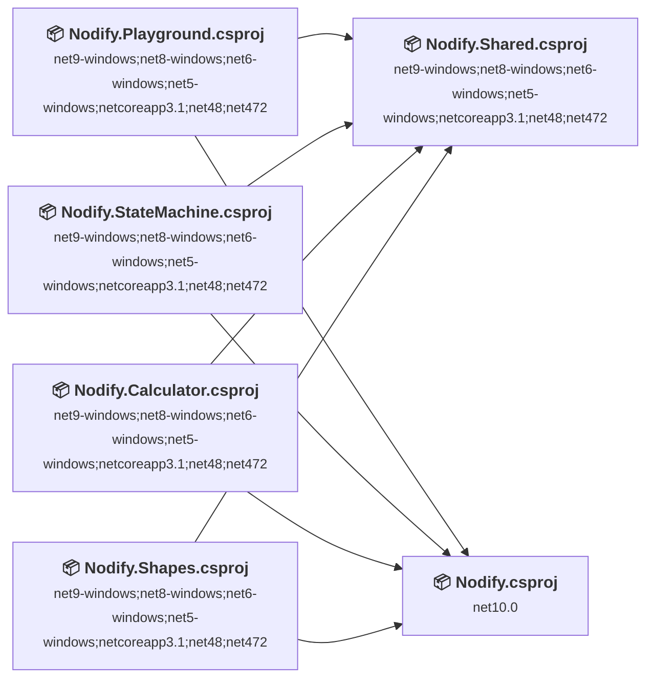
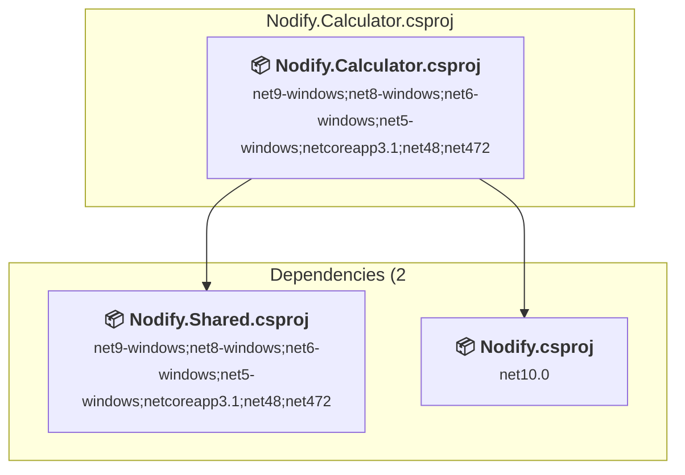
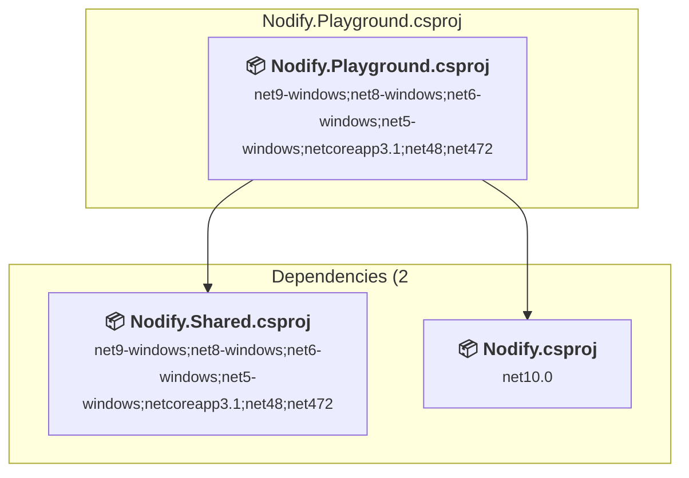
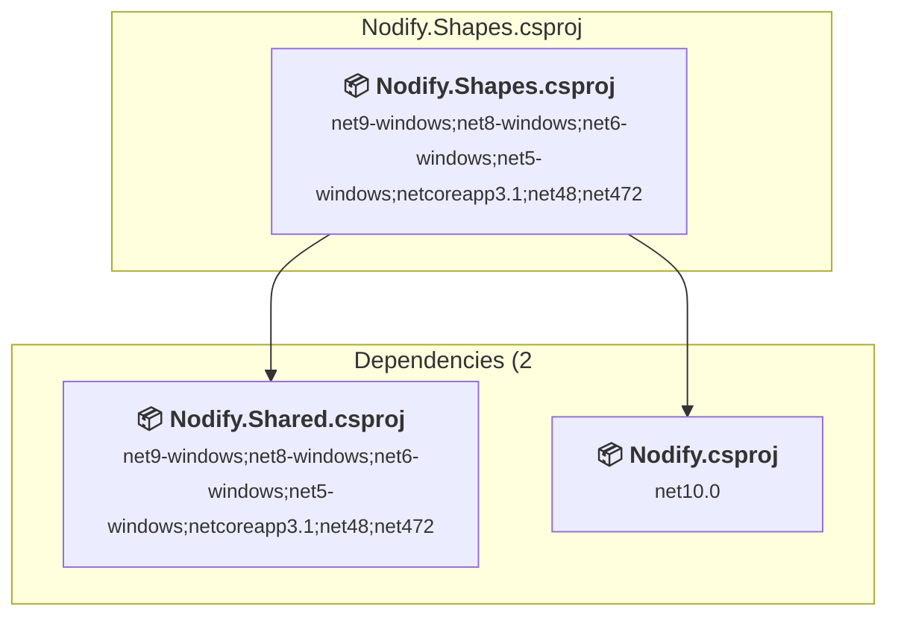
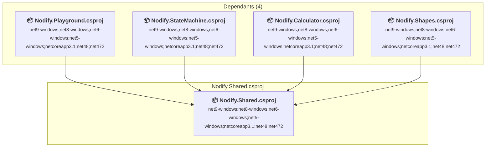
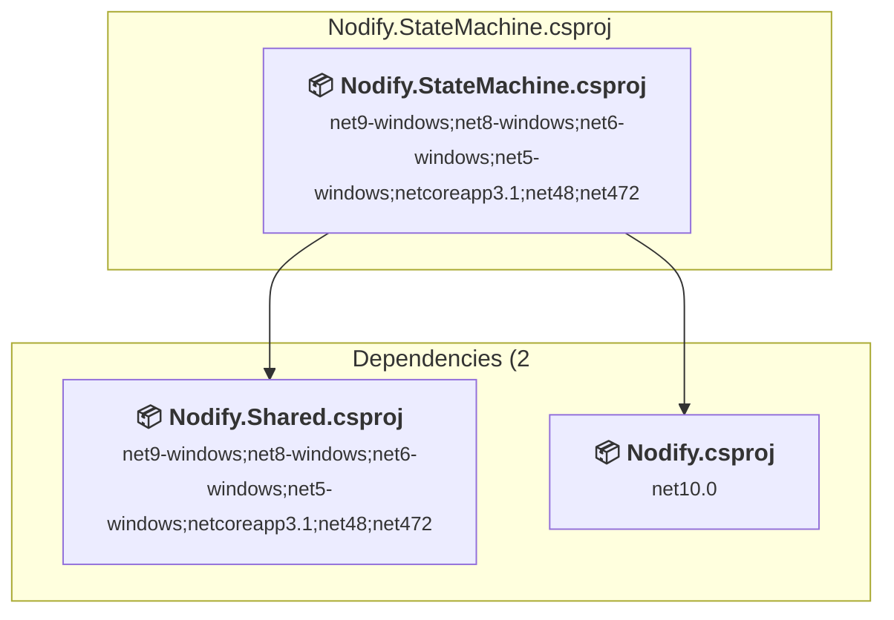
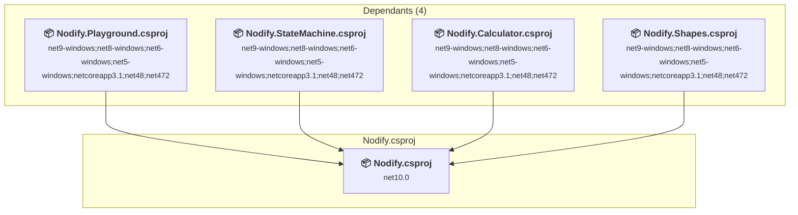

# Projects and dependencies analysis

This document provides a comprehensive overview of the projects and their dependencies in the context of upgrading to .NETCoreApp,Version=v10.0.

## Table of Contents

- [Executive Summary](#executive-Summary)
  - [Highlevel Metrics](#highlevel-metrics)
  - [Projects Compatibility](#projects-compatibility)
  - [Package Compatibility](#package-compatibility)
  - [API Compatibility](#api-compatibility)
- [Aggregate NuGet packages details](#aggregate-nuget-packages-details)
- [Top API Migration Challenges](#top-api-migration-challenges)
  - [Technologies and Features](#technologies-and-features)
  - [Most Frequent API Issues](#most-frequent-api-issues)
- [Projects Relationship Graph](#projects-relationship-graph)
- [Project Details](#project-details)

  - [Examples\Nodify.Calculator\Nodify.Calculator.csproj](#examplesnodifycalculatornodifycalculatorcsproj)
  - [Examples\Nodify.Playground\Nodify.Playground.csproj](#examplesnodifyplaygroundnodifyplaygroundcsproj)
  - [Examples\Nodify.Shapes\Nodify.Shapes.csproj](#examplesnodifyshapesnodifyshapescsproj)
  - [Examples\Nodify.Shared\Nodify.Shared.csproj](#examplesnodifysharednodifysharedcsproj)
  - [Examples\Nodify.StateMachine\Nodify.StateMachine.csproj](#examplesnodifystatemachinenodifystatemachinecsproj)
  - [Nodify\Nodify.csproj](#nodifynodifycsproj)

## Executive Summary

### Highlevel Metrics

| Metric | Count | Status |
| :--- | :---: | :--- |
| Total Projects | 6 | 5 require upgrade |
| Total NuGet Packages | 3 | All compatible |
| Total Code Files | 248 |  |
| Total Code Files with Incidents | 24 |  |
| Total Lines of Code | 23626 |  |
| Total Number of Issues | 494 |  |
| Estimated LOC to modify | 489+ | at least 2.1% of codebase |

### Projects Compatibility

| Project | Target Framework | Difficulty | Package Issues | API Issues | Est. LOC Impact | Description |
| :--- | :---: | :---: | :---: | :---: | :---: | :--- |
| [Examples\Nodify.Calculator\Nodify.Calculator.csproj](#examplesnodifycalculatornodifycalculatorcsproj) | net9-windows;net8-windows;net6-windows;net5-windows;netcoreapp3.1;net48;net472 | 🟢 Low | 0 | 0 |  | Wpf, Sdk Style = True |
| [Examples\Nodify.Playground\Nodify.Playground.csproj](#examplesnodifyplaygroundnodifyplaygroundcsproj) | net9-windows;net8-windows;net6-windows;net5-windows;netcoreapp3.1;net48;net472 | 🟢 Low | 0 | 0 |  | Wpf, Sdk Style = True |
| [Examples\Nodify.Shapes\Nodify.Shapes.csproj](#examplesnodifyshapesnodifyshapescsproj) | net9-windows;net8-windows;net6-windows;net5-windows;netcoreapp3.1;net48;net472 | 🟢 Low | 0 | 0 |  | Wpf, Sdk Style = True |
| [Examples\Nodify.Shared\Nodify.Shared.csproj](#examplesnodifysharednodifysharedcsproj) | net9-windows;net8-windows;net6-windows;net5-windows;netcoreapp3.1;net48;net472 | 🟡 Medium | 0 | 489 | 489+ | Wpf, Sdk Style = True |
| [Examples\Nodify.StateMachine\Nodify.StateMachine.csproj](#examplesnodifystatemachinenodifystatemachinecsproj) | net9-windows;net8-windows;net6-windows;net5-windows;netcoreapp3.1;net48;net472 | 🟢 Low | 0 | 0 |  | Wpf, Sdk Style = True |
| [Nodify\Nodify.csproj](#nodifynodifycsproj) | net10.0 | ✅ None | 0 | 0 |  | ClassLibrary, Sdk Style = True |

### Package Compatibility

| Status | Count | Percentage |
| :--- | :---: | :---: |
| ✅ Compatible | 3 | 100.0% |
| ⚠️ Incompatible | 0 | 0.0% |
| 🔄 Upgrade Recommended | 0 | 0.0% |
| ***Total NuGet Packages*** | ***3*** | ***100%*** |

### API Compatibility

| Category | Count | Impact |
| :--- | :---: | :--- |
| 🔴 Binary Incompatible | 479 | High - Require code changes |
| 🟡 Source Incompatible | 0 | Medium - Needs re-compilation and potential conflicting API error fixing |
| 🔵 Behavioral change | 10 | Low - Behavioral changes that may require testing at runtime |
| ✅ Compatible | 1533 |  |
| ***Total APIs Analyzed*** | ***2022*** |  |

## Aggregate NuGet packages details

| Package | Current Version | Suggested Version | Projects | Description |
| :--- | :---: | :---: | :--- | :--- |
| Avalonia | 11.3.11 |  | [Nodify.csproj](#nodifynodifycsproj) | ✅Compatible |
| Avalonia.Themes.Fluent | 11.3.11 |  | [Nodify.csproj](#nodifynodifycsproj) | ✅Compatible |
| StringMath | 4.1.3 |  | [Nodify.Calculator.csproj](#examplesnodifycalculatornodifycalculatorcsproj) | ✅Compatible |

## Top API Migration Challenges

### Technologies and Features

| Technology | Issues | Percentage | Migration Path |
| :--- | :---: | :---: | :--- |
| WPF (Windows Presentation Foundation) | 148 | 30.3% | WPF APIs for building Windows desktop applications with XAML-based UI that are available in .NET on Windows. WPF provides rich desktop UI capabilities with data binding and styling. Enable Windows Desktop support: Option 1 (Recommended): Target net9.0-windows; Option 2: Add <UseWindowsDesktop>true</UseWindowsDesktop>. |

### Most Frequent API Issues

| API | Count | Percentage | Category |
| :--- | :---: | :---: | :--- |
| T:System.Windows.DependencyProperty | 76 | 15.5% | Binary Incompatible |
| T:System.Windows.Visibility | 28 | 5.7% | Binary Incompatible |
| M:System.Windows.DependencyObject.SetValue(System.Windows.DependencyProperty,System.Object) | 20 | 4.1% | Binary Incompatible |
| M:System.Windows.DependencyObject.GetValue(System.Windows.DependencyProperty) | 20 | 4.1% | Binary Incompatible |
| T:System.Windows.Controls.TextBox | 17 | 3.5% | Binary Incompatible |
| T:System.Windows.FrameworkPropertyMetadata | 16 | 3.3% | Binary Incompatible |
| M:System.Windows.FrameworkPropertyMetadata.#ctor(System.Object) | 16 | 3.3% | Binary Incompatible |
| M:System.Windows.DependencyProperty.OverrideMetadata(System.Type,System.Windows.PropertyMetadata) | 16 | 3.3% | Binary Incompatible |
| T:System.Windows.FrameworkElement | 12 | 2.5% | Binary Incompatible |
| F:System.Windows.FrameworkElement.DefaultStyleKeyProperty | 12 | 2.5% | Binary Incompatible |
| T:System.Windows.Media.Color | 10 | 2.0% | Binary Incompatible |
| T:System.Windows.Input.Key | 9 | 1.8% | Binary Incompatible |
| T:System.Windows.Data.IValueConverter | 9 | 1.8% | Binary Incompatible |
| T:System.Windows.Controls.Primitives.Thumb | 7 | 1.4% | Binary Incompatible |
| T:System.Uri | 7 | 1.4% | Behavioral Change |
| T:System.Windows.Controls.ScrollViewer | 7 | 1.4% | Binary Incompatible |
| F:System.Windows.Visibility.Visible | 6 | 1.2% | Binary Incompatible |
| T:System.Windows.RoutedEvent | 6 | 1.2% | Binary Incompatible |
| M:System.Windows.UIElement.AddHandler(System.Windows.RoutedEvent,System.Delegate) | 6 | 1.2% | Binary Incompatible |
| T:System.Windows.Application | 6 | 1.2% | Binary Incompatible |
| P:System.Windows.RoutedEventArgs.Handled | 5 | 1.0% | Binary Incompatible |
| T:System.Windows.DependencyObject | 5 | 1.0% | Binary Incompatible |
| T:System.Windows.Controls.Primitives.DragDeltaEventArgs | 5 | 1.0% | Binary Incompatible |
| T:System.Windows.DependencyPropertyChangedEventHandler | 4 | 0.8% | Binary Incompatible |
| T:System.Windows.Input.KeyboardFocusChangedEventHandler | 4 | 0.8% | Binary Incompatible |
| T:System.Windows.RoutedEventHandler | 4 | 0.8% | Binary Incompatible |
| T:System.Windows.UIElement | 4 | 0.8% | Binary Incompatible |
| F:System.Windows.UIElement.FocusableProperty | 4 | 0.8% | Binary Incompatible |
| M:System.Windows.Markup.MarkupExtension.#ctor | 4 | 0.8% | Binary Incompatible |
| T:System.Windows.Markup.MarkupExtension | 4 | 0.8% | Binary Incompatible |
| E:System.Windows.Input.CommandManager.RequerySuggested | 4 | 0.8% | Binary Incompatible |
| T:System.Windows.Controls.Canvas | 4 | 0.8% | Binary Incompatible |
| T:System.Windows.ResourceDictionary | 4 | 0.8% | Binary Incompatible |
| P:System.Windows.Input.KeyEventArgs.Key | 3 | 0.6% | Binary Incompatible |
| T:System.Windows.Input.MouseButtonEventArgs | 3 | 0.6% | Binary Incompatible |
| T:System.Windows.Input.MouseButton | 3 | 0.6% | Binary Incompatible |
| T:System.Windows.TextTrimming | 3 | 0.6% | Binary Incompatible |
| T:System.Windows.TextWrapping | 3 | 0.6% | Binary Incompatible |
| F:System.Windows.Visibility.Collapsed | 3 | 0.6% | Binary Incompatible |
| P:System.Windows.Application.Current | 3 | 0.6% | Binary Incompatible |
| P:System.Windows.Application.Resources | 3 | 0.6% | Binary Incompatible |
| P:System.Windows.ResourceDictionary.MergedDictionaries | 3 | 0.6% | Binary Incompatible |
| P:System.Windows.ResourceDictionary.Source | 3 | 0.6% | Binary Incompatible |
| M:System.Uri.#ctor(System.String) | 3 | 0.6% | Behavioral Change |
| T:System.Windows.Media.SolidColorBrush | 3 | 0.6% | Binary Incompatible |
| M:System.Windows.Media.SolidColorBrush.#ctor(System.Windows.Media.Color) | 3 | 0.6% | Binary Incompatible |
| M:System.Windows.TemplatePartAttribute.#ctor | 2 | 0.4% | Binary Incompatible |
| T:System.Windows.TemplatePartAttribute | 2 | 0.4% | Binary Incompatible |
| F:System.Windows.Input.Key.Enter | 2 | 0.4% | Binary Incompatible |
| T:System.Windows.DependencyPropertyChangedEventArgs | 2 | 0.4% | Binary Incompatible |

## Projects Relationship Graph

Legend:
📦 SDK-style project
⚙️ Classic project

## Project Details

### Examples\Nodify.Calculator\Nodify.Calculator.csproj

#### Project Info

- **Current Target Framework:** net9-windows;net8-windows;net6-windows;net5-windows;netcoreapp3.1;net48;net472
- **Proposed Target Framework:** net9-windows;net8-windows;net6-windows;net5-windows;netcoreapp3.1;net48;net472;net10.0-windows
- **SDK-style**: True
- **Project Kind:** Wpf
- **Dependencies**: 2
- **Dependants**: 0
- **Number of Files**: 30
- **Number of Files with Incidents**: 1
- **Lines of Code**: 1400
- **Estimated LOC to modify**: 0+ (at least 0.0% of the project)

#### Dependency Graph

Legend:
📦 SDK-style project
⚙️ Classic project

### API Compatibility

| Category | Count | Impact |
| :--- | :---: | :--- |
| 🔴 Binary Incompatible | 0 | High - Require code changes |
| 🟡 Source Incompatible | 0 | Medium - Needs re-compilation and potential conflicting API error fixing |
| 🔵 Behavioral change | 0 | Low - Behavioral changes that may require testing at runtime |
| ✅ Compatible | 0 |  |
| ***Total APIs Analyzed*** | ***0*** |  |

### Examples\Nodify.Playground\Nodify.Playground.csproj

#### Project Info

- **Current Target Framework:** net9-windows;net8-windows;net6-windows;net5-windows;netcoreapp3.1;net48;net472
- **Proposed Target Framework:** net9-windows;net8-windows;net6-windows;net5-windows;netcoreapp3.1;net48;net472;net10.0-windows
- **SDK-style**: True
- **Project Kind:** Wpf
- **Dependencies**: 2
- **Dependants**: 0
- **Number of Files**: 31
- **Number of Files with Incidents**: 1
- **Lines of Code**: 2961
- **Estimated LOC to modify**: 0+ (at least 0.0% of the project)

#### Dependency Graph

Legend:
📦 SDK-style project
⚙️ Classic project

### API Compatibility

| Category | Count | Impact |
| :--- | :---: | :--- |
| 🔴 Binary Incompatible | 0 | High - Require code changes |
| 🟡 Source Incompatible | 0 | Medium - Needs re-compilation and potential conflicting API error fixing |
| 🔵 Behavioral change | 0 | Low - Behavioral changes that may require testing at runtime |
| ✅ Compatible | 0 |  |
| ***Total APIs Analyzed*** | ***0*** |  |

### Examples\Nodify.Shapes\Nodify.Shapes.csproj

#### Project Info

- **Current Target Framework:** net9-windows;net8-windows;net6-windows;net5-windows;netcoreapp3.1;net48;net472
- **Proposed Target Framework:** net9-windows;net8-windows;net6-windows;net5-windows;netcoreapp3.1;net48;net472;net10.0-windows
- **SDK-style**: True
- **Project Kind:** Wpf
- **Dependencies**: 2
- **Dependants**: 0
- **Number of Files**: 23
- **Number of Files with Incidents**: 1
- **Lines of Code**: 1008
- **Estimated LOC to modify**: 0+ (at least 0.0% of the project)

#### Dependency Graph

Legend:
📦 SDK-style project
⚙️ Classic project

### API Compatibility

| Category | Count | Impact |
| :--- | :---: | :--- |
| 🔴 Binary Incompatible | 0 | High - Require code changes |
| 🟡 Source Incompatible | 0 | Medium - Needs re-compilation and potential conflicting API error fixing |
| 🔵 Behavioral change | 0 | Low - Behavioral changes that may require testing at runtime |
| ✅ Compatible | 0 |  |
| ***Total APIs Analyzed*** | ***0*** |  |

### Examples\Nodify.Shared\Nodify.Shared.csproj

#### Project Info

- **Current Target Framework:** net9-windows;net8-windows;net6-windows;net5-windows;netcoreapp3.1;net48;net472
- **Proposed Target Framework:** net9-windows;net8-windows;net6-windows;net5-windows;netcoreapp3.1;net48;net472;net10.0-windows
- **SDK-style**: True
- **Project Kind:** Wpf
- **Dependencies**: 0
- **Dependants**: 4
- **Number of Files**: 30
- **Number of Files with Incidents**: 20
- **Lines of Code**: 1935
- **Estimated LOC to modify**: 489+ (at least 25.3% of the project)

#### Dependency Graph

Legend:
📦 SDK-style project
⚙️ Classic project

### API Compatibility

| Category | Count | Impact |
| :--- | :---: | :--- |
| 🔴 Binary Incompatible | 479 | High - Require code changes |
| 🟡 Source Incompatible | 0 | Medium - Needs re-compilation and potential conflicting API error fixing |
| 🔵 Behavioral change | 10 | Low - Behavioral changes that may require testing at runtime |
| ✅ Compatible | 1533 |  |
| ***Total APIs Analyzed*** | ***2022*** |  |

#### Project Technologies and Features

| Technology | Issues | Percentage | Migration Path |
| :--- | :---: | :---: | :--- |
| WPF (Windows Presentation Foundation) | 148 | 30.3% | WPF APIs for building Windows desktop applications with XAML-based UI that are available in .NET on Windows. WPF provides rich desktop UI capabilities with data binding and styling. Enable Windows Desktop support: Option 1 (Recommended): Target net9.0-windows; Option 2: Add <UseWindowsDesktop>true</UseWindowsDesktop>. |

### Examples\Nodify.StateMachine\Nodify.StateMachine.csproj

#### Project Info

- **Current Target Framework:** net9-windows;net8-windows;net6-windows;net5-windows;netcoreapp3.1;net48;net472
- **Proposed Target Framework:** net9-windows;net8-windows;net6-windows;net5-windows;netcoreapp3.1;net48;net472;net10.0-windows
- **SDK-style**: True
- **Project Kind:** Wpf
- **Dependencies**: 2
- **Dependants**: 0
- **Number of Files**: 36
- **Number of Files with Incidents**: 1
- **Lines of Code**: 1893
- **Estimated LOC to modify**: 0+ (at least 0.0% of the project)

#### Dependency Graph

Legend:
📦 SDK-style project
⚙️ Classic project

### API Compatibility

| Category | Count | Impact |
| :--- | :---: | :--- |
| 🔴 Binary Incompatible | 0 | High - Require code changes |
| 🟡 Source Incompatible | 0 | Medium - Needs re-compilation and potential conflicting API error fixing |
| 🔵 Behavioral change | 0 | Low - Behavioral changes that may require testing at runtime |
| ✅ Compatible | 0 |  |
| ***Total APIs Analyzed*** | ***0*** |  |

### Nodify\Nodify.csproj

#### Project Info

- **Current Target Framework:** net10.0✅
- **SDK-style**: True
- **Project Kind:** ClassLibrary
- **Dependencies**: 0
- **Dependants**: 4
- **Number of Files**: 98
- **Lines of Code**: 14429
- **Estimated LOC to modify**: 0+ (at least 0.0% of the project)

#### Dependency Graph

Legend:
📦 SDK-style project
⚙️ Classic project

### API Compatibility

| Category | Count | Impact |
| :--- | :---: | :--- |
| 🔴 Binary Incompatible | 0 | High - Require code changes |
| 🟡 Source Incompatible | 0 | Medium - Needs re-compilation and potential conflicting API error fixing |
| 🔵 Behavioral change | 0 | Low - Behavioral changes that may require testing at runtime |
| ✅ Compatible | 0 |  |
| ***Total APIs Analyzed*** | ***0*** |  |

